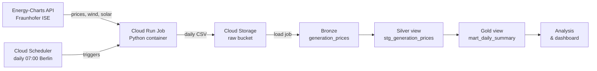
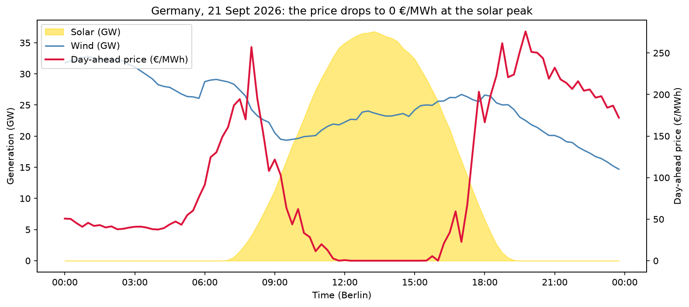

# germany-energy-data-pipeline

Automated data pipeline for German electricity generation (wind, solar) and day-ahead prices, built on Google Cloud with Terraform, BigQuery and Cloud Run.

Every morning at 07:00 (Berlin time), the pipeline automatically fetches the previous day's data at 15-minute resolution, stores it in Cloud Storage and loads it into BigQuery, where it is analysed with SQL. The whole infrastructure is defined as code with Terraform.

📊 **[Live dashboard (Looker Studio)](https://datastudio.google.com/reporting/0a416ce2-442e-45c9-a1d5-1c43b2747553)** – updated daily from BigQuery

**Tech stack:** Python · pandas · SQL · Google Cloud (Cloud Storage, BigQuery, Cloud Run, Cloud Scheduler, Cloud Build, Artifact Registry, IAM) · Terraform · Docker · Git

## Architecture



**How it works:**
1. Every morning at 07:00 (Berlin time), **Cloud Scheduler** triggers a **Cloud Run job**.
2. The job runs a Python container that fetches the previous day's day-ahead prices and wind and solar generation (15-minute resolution) from the **Energy-Charts API**.
3. The data is saved as a CSV file in **Cloud Storage** (raw layer), then loaded into **BigQuery**.
4. Loading is **idempotent**: rows for the same day are deleted before being reloaded, so re-running a day never creates duplicates.
5. A **backfill script** loads historical data from 1 October 2025, when the European day-ahead market switched to 15-minute prices. API calls are retried automatically with increasing waits when the rate limit is reached (HTTP 429), and failed days are retried once at the end.

**Data layers (medallion architecture):**
- **Bronze** – `energy.generation_prices`: raw quarter-hourly data, as loaded from the API.
- **Silver** – `energy.stg_generation_prices` ([SQL](sql/staging/stg_generation_prices.sql)): Berlin time, date, total wind and total renewable generation.
- **Gold** – `energy.mart_daily_summary` ([SQL](sql/marts/mart_daily_summary.sql)): one row per day with average, min and max price, daily price spread, zero-price quarter-hours, solar and wind energy (GWh).

Silver and gold are BigQuery views managed by Terraform: they are always up to date, with no extra processing step.

**Infrastructure as Code:** all cloud resources (storage, BigQuery dataset and views, container registry, Cloud Run job, scheduler, service accounts and permissions) are defined with **Terraform** in [`terraform/`](terraform/). The deployed image version is controlled by a single variable (`image_tag`).

**Security:** three dedicated service accounts follow the principle of least privilege:
- `cloud-build-sa` builds the container image (read source, write image, write logs);
- `energy-pipeline-sa` runs the pipeline, with write access limited to the raw bucket and the `energy` dataset;
- `scheduler-sa` can only trigger the pipeline job.

The raw bucket enforces public access prevention, and all data stays in the `europe-west3` (Frankfurt) region.

## Project structure

```
├── ingestion/
│   ├── fetch_data.py          # fetch one day from the API (default: yesterday)
│   ├── load_to_gcp.py         # upload to Cloud Storage + idempotent load into BigQuery
│   ├── backfill.py            # load a range of past days, with automatic retry
│   ├── requirements.txt       # dependencies of the pipeline container only
│   └── explore_api.py, inspect_*.py   # first exploration scripts
├── notebooks/                 # exploration and visualization (prices, wind & solar, chart)
├── sql/
│   ├── quality/missing_days.sql
│   ├── rows_per_day.sql
│   └── *.sql                  # analysis queries used for the key insights
├── terraform/                 # all Google Cloud infrastructure
├── docs/images/               # charts used in this README
├── Dockerfile                 # container image of the pipeline
├── cloudbuild.yaml            # image build with a dedicated service account
└── requirements.txt           # full development environment (incl. notebooks)
```

## Getting started

**Prerequisites:** Python 3.12, the [Google Cloud CLI](https://cloud.google.com/sdk/docs/install), [Terraform](https://developer.hashicorp.com/terraform/install) ≥ 1.5, and a Google Cloud project linked to a billing account.

> The project ID `tatiana-energy-pipeline` is set in `terraform/variables.tf` and in `ingestion/load_to_gcp.py`. Replace it with your own project ID before deploying.

**1. Authenticate and install dependencies**

```bash
gcloud auth login
gcloud auth application-default login
gcloud config set project <your-project-id>
pip install -r requirements.txt
```

**2. Create the base infrastructure**

```bash
cd terraform
terraform init
terraform plan
terraform apply
cd ..
```

**3. Build the container image**

```bash
gcloud builds submit --config cloudbuild.yaml --substitutions=_TAG=v2
```

**4. Run the pipeline**

```bash
# locally, for one day, without uploading
python ingestion/fetch_data.py --date 2026-09-21

# locally, with upload to Cloud Storage and BigQuery
python ingestion/fetch_data.py --date 2026-09-21 --upload

# in the cloud (loads yesterday)
gcloud run jobs execute fetch-data --region=europe-west3 --wait

# backfill a period
python ingestion/backfill.py --start 2025-10-01 --end 2026-09-27
```

**5. Check data quality in BigQuery**

- [`sql/rows_per_day.sql`](sql/rows_per_day.sql): each day should have 96 quarter-hours (92 or 100 on daylight saving time changes).
- [`sql/quality/missing_days.sql`](sql/quality/missing_days.sql): lists missing or incomplete days over the backfill period. An empty result means the data is complete.

## Key Insights

### Solar pushes the day-ahead price down to zero (21 September 2026)



**Findings** (all times in Berlin time):
- From **11:45 to 15:45**, the day-ahead price stayed **below 1 €/MWh** for 4 hours in a row, including **105 minutes at exactly 0 €/MWh** between 13:00 and 15:15.
- This window matches the **solar peak**: solar generation stayed between 29 and 37 GW, with a maximum of **36,814 MW at 13:15**.
- The most expensive moments came **when solar was absent**: **257.09 €/MWh at 08:00** (morning peak) and **275.90 €/MWh at 19:45** (evening peak, solar at 0 MW). Four of the five most expensive quarter-hours were in the evening.
- The spread between the cheapest and the most expensive quarter-hour reached **almost 276 €/MWh within a single day**.

**Why it matters:**
Wind and solar have near-zero marginal costs. When they cover most of the demand, expensive gas and coal plants are no longer needed and the price collapses (merit order effect). As soon as the sun sets, demand is still high but solar is gone, and prices spike. These daily price spreads are what batteries, smart charging and flexible consumption can take advantage of: storing or using electricity when it is cheap, and avoiding the expensive hours.

**Queries used in BigQuery:** see [`sql/`](sql/)
- [`cheap_quarter_hours.sql`](sql/cheap_quarter_hours.sql) – quarter-hours below 5 €/MWh
- [`zero_price_window.sql`](sql/zero_price_window.sql) – time window and duration at 0 €/MWh
- [`most_expensive_quarter_hours.sql`](sql/most_expensive_quarter_hours.sql) – five most expensive quarter-hours

## Costs

The pipeline is designed to stay very small: one short Cloud Run execution per day, a few kilobytes of data per day, and BigQuery queries far below the free monthly query allowance. A budget alert is configured on the project to send an email if spending exceeds a small threshold.

## Cleanup

```bash
cd terraform
terraform destroy
```

Note: the BigQuery table `generation_prices` is created by the first load job, not by Terraform, and the dataset is protected against deletion while it contains tables. Delete the table first (in the BigQuery console or with `bq rm energy.generation_prices`) before running `terraform destroy`.

## Roadmap

- [x] Daily summary table (average, min and max price, total wind and solar generation)
- [ ] Dashboard (Looker Studio or Power BI connected to BigQuery)
- [ ] Email alert when the daily job fails (Cloud Monitoring)
- [ ] Unit tests with `pytest`
- [ ] CI/CD with GitHub Actions (tests, `terraform fmt` and `terraform validate`)
- [ ] Remote Terraform state in a Cloud Storage bucket
- [ ] BigQuery table managed by Terraform, partitioned by date
- [ ] Same pipeline on AWS (S3, Athena, Lambda, EventBridge)

## Documentation & References

### Data source
- [Energy-Charts API (Fraunhofer ISE)](https://api.energy-charts.info/) – electricity generation and day-ahead prices, license CC BY 4.0
- [15-minute products in the day-ahead market (EPEX SPOT)](https://www.epexspot.com/en/15-minute-day-ahead) – why the backfill starts on 1 October 2025

### Python
- [requests](https://requests.readthedocs.io/) – calling the API
- [pandas.to_datetime](https://pandas.pydata.org/docs/reference/api/pandas.to_datetime.html) – converting Unix timestamps
- [pandas.DataFrame.merge](https://pandas.pydata.org/docs/reference/api/pandas.DataFrame.merge.html) – joining generation and prices
- [argparse](https://docs.python.org/3/library/argparse.html) – command-line options (`--date`, `--upload`, `--start`, `--end`)
- [Handling exceptions with try / except](https://docs.python.org/3/tutorial/errors.html#handling-exceptions) – continuing the backfill when a day fails
- [Generators and yield](https://docs.python.org/3/tutorial/classes.html#generators) – iterating over a date range
- [List comprehensions](https://docs.python.org/3/tutorial/datastructures.html#list-comprehensions)

### Google Cloud setup
- [gcloud projects create](https://cloud.google.com/sdk/gcloud/reference/projects/create)
- [gcloud billing projects link](https://cloud.google.com/sdk/gcloud/reference/billing/projects/link)
- [Application Default Credentials (ADC)](https://cloud.google.com/docs/authentication/application-default-credentials)
- [Budgets and budget alerts](https://cloud.google.com/billing/docs/how-to/budgets)

### Terraform
- [Terraform CLI commands (init, plan, apply)](https://developer.hashicorp.com/terraform/cli/commands)
- [Input variables](https://developer.hashicorp.com/terraform/language/values/variables) – `project_id`, `region`, `image_tag`
- [for_each](https://developer.hashicorp.com/terraform/language/meta-arguments/for_each) – granting several roles with one block
- [Google provider](https://registry.terraform.io/providers/hashicorp/google/latest/docs)
- [google_project_service](https://registry.terraform.io/providers/hashicorp/google/latest/docs/resources/google_project_service)
- [google_storage_bucket](https://registry.terraform.io/providers/hashicorp/google/latest/docs/resources/storage_bucket)
- [google_bigquery_dataset](https://registry.terraform.io/providers/hashicorp/google/latest/docs/resources/bigquery_dataset)
- [google_artifact_registry_repository](https://registry.terraform.io/providers/hashicorp/google/latest/docs/resources/artifact_registry_repository)
- [google_service_account](https://registry.terraform.io/providers/hashicorp/google/latest/docs/resources/google_service_account)
- [google_project_iam_member](https://registry.terraform.io/providers/hashicorp/google/latest/docs/resources/google_project_iam)
- [google_storage_bucket_iam_member](https://registry.terraform.io/providers/hashicorp/google/latest/docs/resources/storage_bucket_iam)
- [google_bigquery_dataset_iam_member](https://registry.terraform.io/providers/hashicorp/google/latest/docs/resources/bigquery_dataset_iam)
- [google_cloud_run_v2_job](https://registry.terraform.io/providers/hashicorp/google/latest/docs/resources/cloud_run_v2_job)
- [google_cloud_run_v2_job_iam_member](https://registry.terraform.io/providers/hashicorp/google/latest/docs/resources/cloud_run_v2_job_iam)
- [google_cloud_scheduler_job](https://registry.terraform.io/providers/hashicorp/google/latest/docs/resources/cloud_scheduler_job)

### Cloud Storage & BigQuery
- [gcloud storage cp](https://cloud.google.com/sdk/gcloud/reference/storage/cp) – uploading files to Cloud Storage
- [Cloud Storage Python client](https://cloud.google.com/python/docs/reference/storage/latest)
- [BigQuery Python client](https://cloud.google.com/python/docs/reference/bigquery/latest)
- [Loading CSV data from Cloud Storage](https://cloud.google.com/bigquery/docs/loading-data-cloud-storage-csv)
- [bq load reference](https://cloud.google.com/bigquery/docs/reference/bq-cli-reference#bq_load)
- [Parameterized queries](https://cloud.google.com/bigquery/docs/parameterized-queries) – safe, idempotent DELETE
- [DELETE statement (DML)](https://cloud.google.com/bigquery/docs/reference/standard-sql/dml-syntax#delete_statement)
- [BigQuery DATETIME function](https://cloud.google.com/bigquery/docs/reference/standard-sql/datetime_functions#datetime) – converting UTC to Berlin time
- [BigQuery query syntax (SELECT, WHERE, GROUP BY, ORDER BY, LIMIT)](https://cloud.google.com/bigquery/docs/reference/standard-sql/query-syntax)
- [WITH clause (CTE)](https://cloud.google.com/bigquery/docs/reference/standard-sql/query-syntax#with_clause) – quality check query
- [GENERATE_DATE_ARRAY](https://cloud.google.com/bigquery/docs/reference/standard-sql/array_functions#generate_date_array) – list of expected days
- [BigQuery pricing](https://cloud.google.com/bigquery/pricing) – on-demand queries, first 1 TiB per month free
- [BigQuery views](https://cloud.google.com/bigquery/docs/views-intro) – silver and gold layers
- [google_bigquery_table (view)](https://registry.terraform.io/providers/hashicorp/google/latest/docs/resources/bigquery_table) – views managed by Terraform
- [Medallion architecture (Databricks)](https://www.databricks.com/glossary/medallion-architecture)

### Deployment & Automation
- [Dockerfile reference](https://docs.docker.com/reference/dockerfile/) – containerizing the pipeline
- [Cloud Build configuration file](https://cloud.google.com/build/docs/build-config-file-schema) – building the image with a dedicated service account
- [Artifact Registry](https://cloud.google.com/artifact-registry/docs/overview) – storing container images
- [Cloud Run jobs](https://cloud.google.com/run/docs/create-jobs) – running the pipeline in the cloud
- [Running jobs on a schedule](https://cloud.google.com/run/docs/execute/jobs-on-schedule) – Cloud Scheduler trigger
- [Cron job format](https://cloud.google.com/scheduler/docs/configuring/cron-job-schedules) – `0 7 * * *`
- [Service accounts](https://cloud.google.com/iam/docs/service-account-overview) – least-privilege identities
- [Cloud Run job logs](https://cloud.google.com/run/docs/logging) – debugging failed executions
- [Retry strategy with exponential backoff](https://cloud.google.com/storage/docs/retry-strategy#exponential-backoff) – handling API rate limits
- [HTTP 429 Too Many Requests (MDN)](https://developer.mozilla.org/en-US/docs/Web/HTTP/Status/429)

### Visualization
- [pandas.read_csv](https://pandas.pydata.org/docs/reference/api/pandas.read_csv.html) – reading the processed CSV with `parse_dates`
- [matplotlib fill_between](https://matplotlib.org/stable/api/_as_gen/matplotlib.axes.Axes.fill_between.html) – solar area under the curve
- [matplotlib twinx](https://matplotlib.org/stable/api/_as_gen/matplotlib.axes.Axes.twinx.html) – second y-axis for the price
- [matplotlib DateFormatter](https://matplotlib.org/stable/api/dates_api.html#matplotlib.dates.DateFormatter) – hours on the x-axis in Berlin time
- [matplotlib savefig](https://matplotlib.org/stable/api/_as_gen/matplotlib.figure.Figure.savefig.html) – exporting the chart as PNG
- [Images in GitHub Markdown](https://docs.github.com/en/get-started/writing-on-github/getting-started-with-writing-and-formatting-on-github/basic-writing-and-formatting-syntax#images) – embedding the chart in this README
- [Mermaid diagrams on GitHub](https://docs.github.com/en/get-started/writing-on-github/working-with-advanced-formatting/creating-diagrams) – architecture diagram

## Author

**Tatiana Tchouakam Chouacheu** – Cloud & Data Engineer, with an engineering background in petroleum and geosciences.

[LinkedIn](https://www.linkedin.com/in/tatiana-tchouakam-chouacheu-91152935b) · [GitHub](https://github.com/TatianaTchouakam) · [YouTube – TatianaBuildsData](https://www.youtube.com/@TatianaBuildsData)